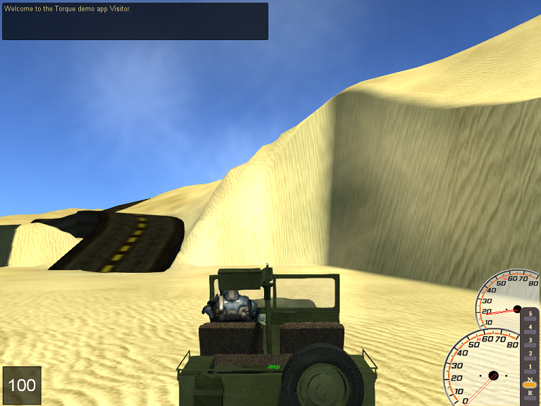

<h1>Wheeled Vehicle Resource</h1>

A collection of upgrades for Wheeled Vehicle handling in Torque 3D. This rolls several core engine resources together with improved script handling for fps-style mounts.

<ul>
<li>RPM-based engine simulation</li>
<li>Definable transmission (up to 7 gears)</li>
<li>Programmable power output.</li>
<li>Tachometer gui</li>
<li>In-game vehicle datablock/settings editor gui</li>
</ul>