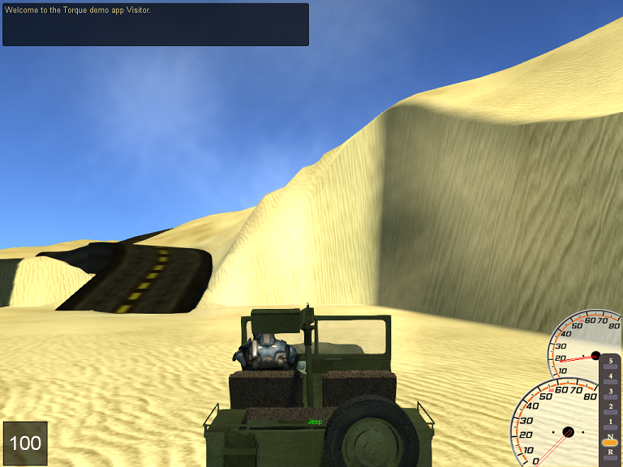

<h1>Wheeled Vehicle Resource</h1>

A collection of upgrades for Wheeled Vehicle behavior ported from TGE to Torque 3D.

This combines and extends several classic engine resources to provide several core improvements. A simulated drive train allows vehicles to be created with a wide range of performence characteristics. A number of GUI elements have been added or improved and script handling for multiple mounts is more fleshed out.

<ul>
<li>RPM-based engine simulation</li>
<li>Definable transmission (up to 7 gears)</li>
<li>Automatic and Manual transmission handling.</li>
<li>Programmable power output.</li>
<li>Tachometer gui</li>
<li>Scripted gear indicator gui</li>
<li>In-game vehicle datablock/settings editor gui</li>
</ul>

Note: This is an unreleased work in progress ... generally all required files will be here and in the proper version to work together, but this repo is still in the process of being built.

Note2: The build seems to work most easily if the shapebase files go directly in the engine directory.

This resource is currently based on T3D 3.8.
<!-- <h3><a href="#">Download</a></h3> -->
<h3><a href="./docs/readme.md">Docs</a></h3>